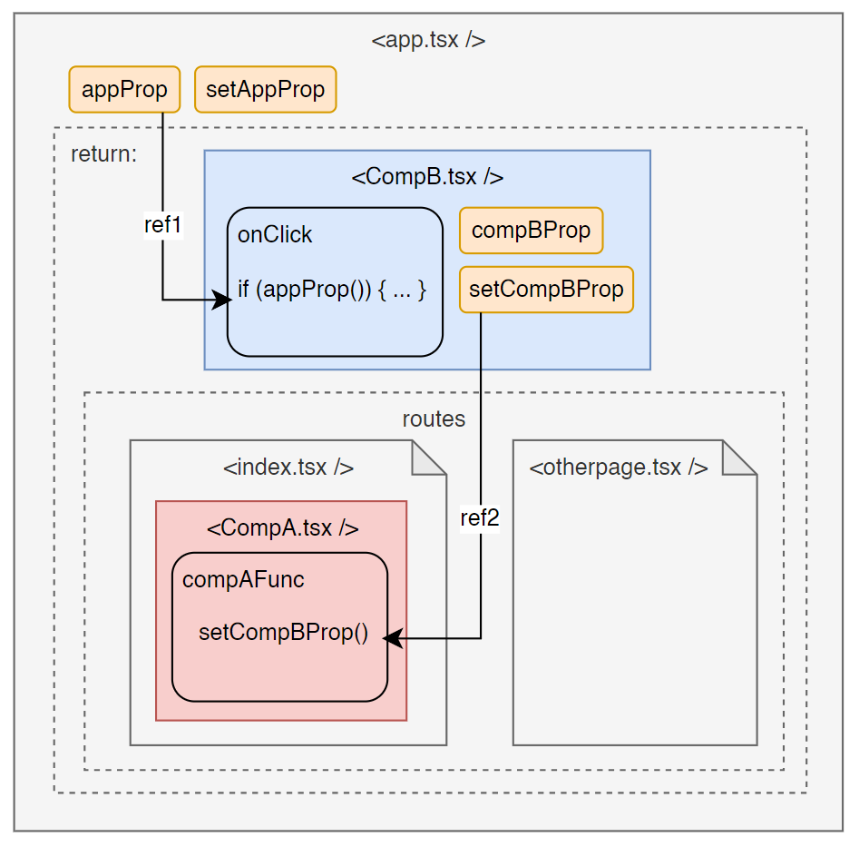

## Setup

```
npm install
npm run dev
```

## Reproduce error

Navigate between the two pages "index" and "Page 2" (/otherpage). Normally when going from index to page 2, importing app.css fails.

## Schema

This is how the app is set up.

The error disappears when either ref1 or ref2 are broken.

